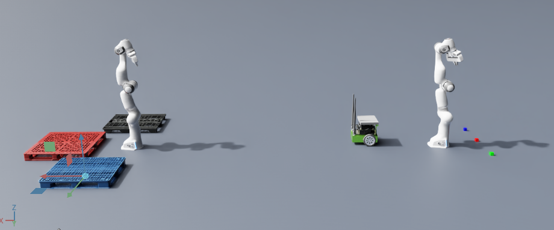

### Start BentoML VLM Service Command:


```bash
bentoml serve server_bento:VLMServiceIsaac --port 8000 --reload
```

### Launch RL Training with **IsaacLab**:
```bash
cd ~/Documents/IsaacLab
``` 
#### Headlessly
```bash
./isaaclab.sh -p scripts/reinforcement_learning/sb3/train.py --task Isaac-Lift-Cube-Franka-IK-Abs-VLM-v0 --num_envs 4096 --headless
```
Continue progress with best model as checkpoint: 
```bash
./isaaclab.sh -p scripts/reinforcement_learning/sb3/train.py \
    --task Isaac-Lift-Cube-Franka-IK-Abs-VLM-v0 \
    --checkpoint logs/sb3/Isaac-Lift-Cube-Franka-IK-Abs-VLM-v0/2026-03-09_10-05-30/model.zip \
    --num_envs 4096 --headless
```

#### Visual Training 
```bash
./isaaclab.sh -p scripts/reinforcement_learning/sb3/train.py --task Isaac-Lift-Cube-Franka-IK-Abs-VLM-v0 --num_envs 64
```

#### Check RL Training Results in Tensorboard:
```bash
tensorboard --logdir ~/Documents/IsaacLab/logs/sb3/Isaac-Lift-Cube-Franka-IK-Abs-VLM-v0
``` 

#### To check the training results:
```bash
LATEST_MODEL=$(find logs/sb3/Isaac-Lift-Cube-Franka-IK-Abs-VLM-v0 -name "*.zip" -printf '%T+ %p\n' | sort -r | head -1 | cut -d' ' -f2-)

./isaaclab.sh -p scripts/reinforcement_learning/sb3/play.py \
    --task Isaac-Lift-Cube-Franka-IK-Abs-VLM-v0 \
    --num_envs 16 \
    --checkpoint "$LATEST_MODEL"
``` 
Or with a specific checkpoint: 
```bash
find logs/sb3/Isaac-Lift-Cube-Franka-IK-Abs-VLM-v0 -name "*.zip"
```
```bash
./isaaclab.sh -p scripts/reinforcement_learning/sb3/play.py \
    --task Isaac-Lift-Cube-Franka-IK-Abs-VLM-v0 \
    --num_envs 16 \
    --checkpoint logs/sb3/Isaac-Lift-Cube-Franka-IK-Abs-VLM-v0/2026-03-08_19-16-10/model.zip
```
Hau hobeto: 
```bash
# Busca el archivo zip más nuevo en la carpeta de logs de tu tarea
LATEST_MODEL=$(ls -t logs/sb3/Isaac-Lift-Cube-Franka-IK-Abs-VLM-v0/**/*.zip | head -1)

# Lánzalo directamente
python scripts/reinforcement_learning/sb3/play.py --task Isaac-Lift-Cube-Franka-IK-Abs-VLM-v0 --num_envs 16 --checkpoint $LATEST_MODEL
``` 


